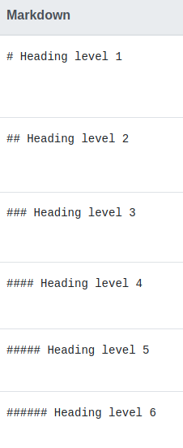
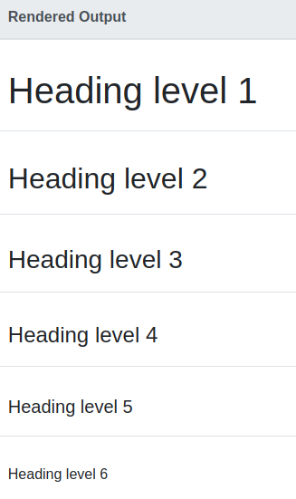
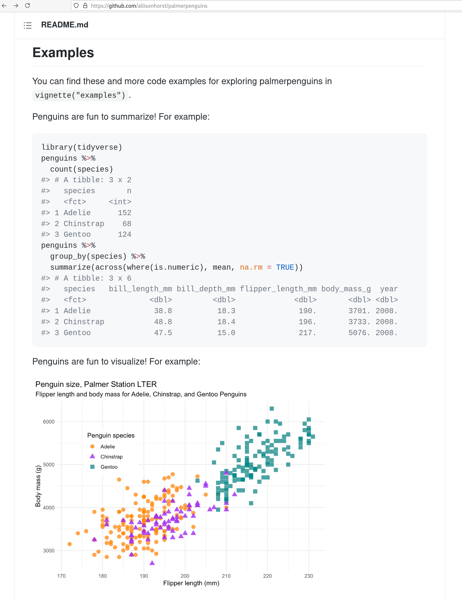
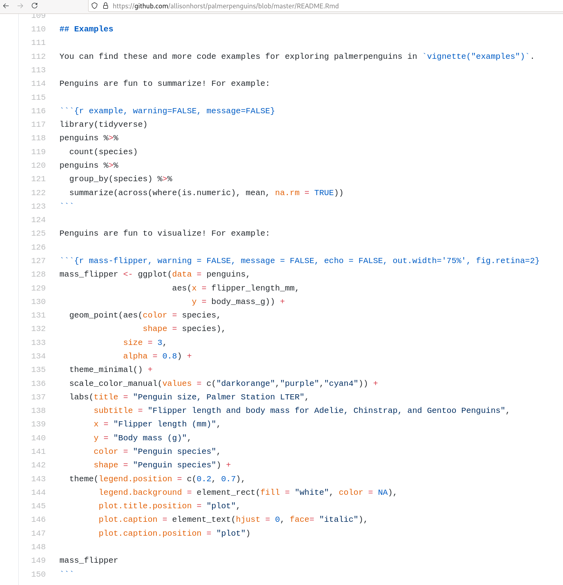

---
title: "Intro to Markdown"
author: "[Karl Dunkle Werner](https://karldw.org)"
date: "June 29, 2021<br><br>Slides:<br>[github.com/karldw/markdown_intro_2021-06-29](github.com/karldw/markdown_intro_2021-06-29)"
output:
  revealjs::revealjs_presentation:
    transition: none
    incremental: false
    slide_level: 1
    css: revealjs_slides.css
    mathjax: default
    pandoc_args:
       - "--filter"
       - "pandoc-citeproc"
       - "--bibliography"
       - "refs.bib"
    reveal_options:
        controls: false
        slideNumber: "c"
        disableLayout: true
---

# Thank you, Pamela!


- #econ_prosem is a great service


# What is Markdown?

- Plain text
    - Which is a good thing! <small>(See [The Plain Person’s Guide to Plain Text Social Science](https://plain-text.co/))</small>
- Readable by itself
- That gets converted into HTML


# Why?

- Lighter weight than LaTeX
    - Easier to jot things down
    - Less fiddly
    - Failure to compile is very rare
- Usable in places Word and LaTeX aren't
    - e.g. every Github page you've seen
    - Your own website (come back July 13!)


# Why?

- Easy to use with version control (e.g. Git)
    - Track changes to your code *and your words* over time
    - Easily search through history
- Prettier than just writing in a `.txt` file


# How do you write it?

- Recommended: Find a general-purpose text editor you like
    - VS Code, Atom, Emacs, Nano, Sublime, Vi, ...
- Or: edit in-website
    - Github
    - Today: [Hedgedoc](https://hedgedoc.org/)

# Syntax Basics

- Headings
- Items
- Enumerations
- Emphasis
- Math
- Code
- Links
- Images

# Headings


::: {.container}
:::: {.col}


::::
:::: {.col}


::::
:::


# Items


::: {.container}
:::: {.col}

```
Groceries:

- Yeast
- Flour
- Basil


Or with checkboxes (not universal):

- [x] Mozzarella
- [ ] Chili flakes
```
::::
:::: {.col}
Groceries:

- Yeast
- Flour
- Basil

Or with checkboxes (not universal):

- [x] Mozzarella
- [ ] Chili flakes
::::
:::


# Enumerations


::: {.container}
:::: {.col}
```
Colors I know:

1. Magenta
1. Cyan
1. Black

Colors I don't know:

4. Taupe
8. Chartreuse
7. Puce
```
::::
:::: {.col}
Colors I know:

1. Magenta
1. Cyan
1. Black

Colors I don't know:

4. Taupe
8. Chartreuse
7. Puce
::::
:::


# Emphasis


::: {.container}
:::: {.col}
```
*Italic* or _italic_

**Bold** or __bold__

***Bold italic*** or ___bold italic___

~~strikethrough~~
```
::::
:::: {.col}
*Italic* or _italic_

**Bold** or __bold__

***Bold italic*** or ___bold italic___

~~strikethrough~~

::::
:::

# Math (inline)

- In: `$a^2 + b^2 = c^2$`
- Out: $a^2 + b^2 = c^2$


# Math (display)

```
\[
\begin{align}
\int_0^\infty f(\cos^2(\psi)) &= z_0\\
&= \pi r^2
\end{align}
\]
```

\[
\begin{align}
\int_0^\infty f(\cos^2(\psi)) &= z_0\\
&= \pi r^2
\end{align}
\]

Caveats:

1. Depends on [Mathjax](https://www.mathjax.org/), which is in some, but not all markdown renderers
1. The [list of supported commands](https://docs.mathjax.org/en/latest/input/tex/macros/index.html) is very long, but it's not a LaTeX substitute


# Code (inline)

- Inline code with single backticks:
    - In: \`y = x1 + x2\`
    - Out: `y = x1 + x2`

# Code (blocks)
- Code blocks with triple backticks
    - Optionally add language syntax highlighting (e.g. `r`)

<!-- Note: there are zero-width spaces in the second set of ``` -->
```
`​`​`r
x = lm(mpg ~ wt + cyl, data=mtcars)
broom::tidy(x)
#> # A tibble: 3 x 5
#>   term        estimate std.error statistic  p.value
#>   <chr>          <dbl>     <dbl>     <dbl>    <dbl>
#> 1 (Intercept)    39.7      1.71      23.1  3.04e-20
#> 2 wt             -3.19     0.757     -4.22 2.22e- 4
#> 3 cyl            -1.51     0.415     -3.64 1.06e- 3
`​`​`
```


```r
x = lm(mpg ~ wt + cyl, data=mtcars)
broom::tidy(x)
#> # A tibble: 3 x 5
#>   term        estimate std.error statistic  p.value
#>   <chr>          <dbl>     <dbl>     <dbl>    <dbl>
#> 1 (Intercept)    39.7      1.71      23.1  3.04e-20
#> 2 wt             -3.19     0.757     -4.22 2.22e- 4
#> 3 cyl            -1.51     0.415     -3.64 1.06e- 3
```

# Comments and Escapes

```
<!--
Block comments

escape everything inside (except in a code block)

This is the same as comments in HTML code
-->

```

<!--
Block comments

escape everything inside

And are the same as HTML comments
-->

- Escape special characters with `\`


# Links

- Plain URLs and emails get auto-linked (usually)
    - https://twitter.com/hashtag/econ_prosem
    - karldw@berkeley.edu
- Text links have the form `[words to display](URL)`
    - In: `[Twitter](https://twitter.com)`
    - Out: [Twitter](https://twitter.com)
- We can also link within the document:
    - In: `[Last section](#/comments-and-escapes)`
    - Out: [Last section](#/comments-and-escapes)

# Images
- Images are almost identical, but with `!` before `[`
    - In: ``
    - Out:


# Tables

- Sometimes easy to read
- Always a pain to write
- Have a computer do it for you (e.g. knitr in R)


::: {.container}
:::: {.col}
```
| Reg. A      | Reg. B          |
| ----------- | --------------- |
| 3.14        | 0.01            |
| [1.0, 10.0] | [-0.001, 0.015] |
```
::::
&#8594;
<!-- right arrow -->

:::: {.col}
| Reg. A      | Reg. B          |
| ----------- | --------------- |
| 3.14        | 0.01            |
| [1.0, 10.0] | [-0.001, 0.015] |

::::
:::

# Tables

```r
x = lm(mpg ~ wt + cyl, data=mtcars)
y = broom::tidy(x)
knitr::kable(y)

#> |term        |  estimate| std.error| statistic|   p.value|
#> |:-----------|---------:|---------:|---------:|---------:|
#> |(Intercept) | 39.686262| 1.7149840| 23.140893| 0.0000000|
#> |wt          | -3.190972| 0.7569065| -4.215808| 0.0002220|
#> |cyl         | -1.507795| 0.4146883| -3.635972| 0.0010643|
```


<center>&#8595;</center>


| term        |  estimate | std.error | statistic |   p.value |
|:------------|----------:|----------:|----------:|----------:|
| (Intercept) | 39.686262 | 1.7149840 | 23.140893 | 0.0000000 |
| wt          | -3.190972 | 0.7569065 | -4.215808 | 0.0002220 |
| cyl         | -1.507795 | 0.4146883 | -3.635972 | 0.0010643 |


# More fancy markdown

- References
- R Markdown (`.Rmd`)
    - Works with Stata too, with [some setup](https://www.ssc.wisc.edu/~hemken/Stataworkshops/Stata%20and%20R%20Markdown/StataMarkdown)
- Direct HTML/CSS
- Footnotes (support varies)
- [Pandoc](https://pandoc.org/) conversion to other formats


# References

- Citations (via [Pandoc](https://pandoc.org/) & [Citeproc](https://github.com/jgm/citeproc))
    - Input: `@Pigouvian_taxes:1932` (from my bib file)
    - Output: @Pigouvian_taxes:1932

```
<!-- Code to ask pandoc to print refs: -->
::: {#refs}
:::
```

::: {#refs}
:::

# [R Markdown](https://rmarkdown.rstudio.com/)

- Combines code and text
- Never have to copy updated tables, figures, or numbers into your text
- Works with Markdown or LaTeX
- Use Knitr to covert `.Rmd` to `.md`
    - Older tool: Sweave
- Use Pandoc to convert `.md` to anything


# What does R Markdown look like?

<center>
[](https://github.com/allisonhorst/palmerpenguins)
</center>

# What does [R Markdown](https://github.com/allisonhorst/palmerpenguins) look like?

::: {.container}
:::: {.col}
[](https://github.com/allisonhorst/palmerpenguins/blob/master/README.md)

::::
&#8594;
<!-- right arrow -->

:::: {.col}
[](https://github.com/allisonhorst/palmerpenguins/blob/master/README.Rmd)

::::
:::


# Zooming in

[](https://github.com/allisonhorst/palmerpenguins/blob/master/README.md)


# Zooming in
[](https://github.com/allisonhorst/palmerpenguins/blob/master/README.Rmd)

# R markdown code blocks

- Almost identical to markdown code blocks
- Start with ` ```{r …} ` instead of ` ``` ` or ` ```r `
- Optionally add chunk name and [options](https://yihui.org/knitr/options/):


```
{r mass-flipper, warning = FALSE, message = FALSE,
    echo = FALSE, out.width='75%', fig.retina=2}
```

# Questions?

- Let's try out markdown in Hedgedoc (link in the chat)


# Links

::: {.container}
:::: {.col}

**Markdown**

- [Basic syntax](https://www.markdownguide.org/basic-syntax)
- [Extended syntax](https://www.markdownguide.org/extended-syntax)
- [Github-flavored markdown](https://guides.github.com/features/mastering-markdown/#GitHub-flavored-markdown)
- [Mathjax](https://www.mathjax.org/)

::::
:::: {.col}

**R Markdown**


- [RStudio's markdown guide](https://rmarkdown.rstudio.com/)
- [Knitr](https://yihui.org/knitr/)
    - Not just R
    - Not just markdown
- [Pandoc](https://pandoc.org/)
    - [Citeproc](https://github.com/jgm/citeproc)
::::
:::
